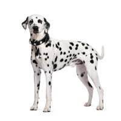

# Abhyasa

Abhyasa = Learning (in Sanskrit Language)

This is a repository of machine learning solutions(Exercise outcomes),
mostly created while I study Machine Learning

## Demo

You can view the app in action here **[https://sravanrekandar.github.io/abhyasa-client/](https://sravanrekandar.github.io/abhyasa-client/)**

## [Development Setup](DEVELOPMENT_SETUP.md)

[Follow the instructions here](DEVELOPMENT_SETUP.md)

### Applications

### App: Dog Breed Detector

[View Demo here](https://github.com/sravanrekandar/abhyasa-client.git)

This trained model can take a dog pic as input and tells you dog's breed.

The model knows three dog types

1. Beagle 
2. Dalmatian 
3. Doberman 

#### API

```text
POST

```
